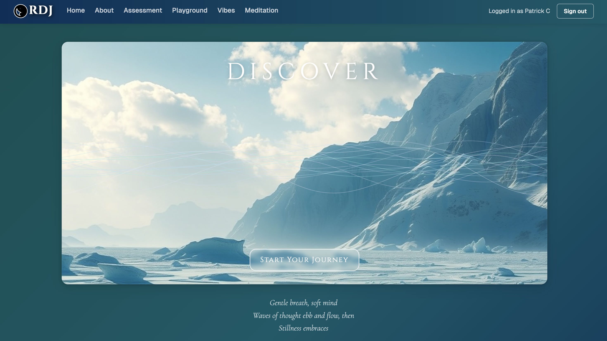

# RDJ - Reflect Discover Jarvis

RDJ (Reflect Discover Jarvis) is a web application that combines AI and psychology to provide a self-discovery and personal growth platform.

## Core Functionality

- **Assessment Generation**: Users can create custom assessments by specifying a topic and number of questions.
- **AI Analysis**: User responses are analyzed to provide insights and personality profiles.
- **Visual Experience**: Interactive shader animations respond to user input and mood.
- **Chat Support**: AI-powered chat for user assistance during the assessment process.
- **Personal Vibes**: Users can create and save personalized visual experiences.
- **Meditation Tools**: Guided breathing exercises and curated meditation content.

## Technical Stack

- **Framework**: Next.js with TypeScript
- **Authentication**: NextAuth.js
- **Database**: PostgreSQL with Drizzle ORM
- **Styling**: Tailwind CSS with shadcn/ui components
- **API Layer**: tRPC for end-to-end type safety
- **State Management**: React hooks and context
- **Animations**: Framer Motion
- **Content Rendering**: React Markdown

## AI Integration

### Together AI
- **Model**: Meta-Llama-3.1-70B-Instruct-Turbo
- **Use Cases**: 
  - Generating assessment questions through JSON output
  - Analyzing user responses
  - Creating personality profiles

### Upstage AI
- **Models**: 
  - Solar-pro (for chat)
  - Solar-docvision (for document analysis)
- **Use Cases**:
  - Powering the chat support feature
  - Analyzing documents or images (Document QA feature)

## Key Components

### Assessment System
- `src/components/main/Assessment.tsx`: Manages the assessment flow
- `src/server/api/routers/assessment.ts`: Handles assessment-related API calls
- `src/hooks/useAssessmentLogic.ts`: Custom hook for assessment state management

### Visual Experience
- `src/components/ShaderComponent.tsx`: Renders dynamic shader visualizations
- `src/components/AIShaderController.tsx`: Controls AI-generated shader configurations
- `src/server/together-ai/shaderAI.ts`: Generates shader configurations based on user mood

### Personal Vibes
- `src/components/PersonalVibes.tsx`: Interface for creating and managing personal visual experiences
- `src/server/api/routers/personalVibe.ts`: Handles personal vibe data storage and retrieval

### Meditation Tools
- `src/components/Meditation.tsx`: Provides meditation exercises and content
- `src/components/main/BreathingExercise.tsx`: Implements guided breathing animation

## Data Flow

1. User initiates an assessment or interacts with the platform
2. Frontend components (`Assessment.tsx`, `PersonalVibes.tsx`) capture user input
3. tRPC routes (`src/server/api/routers/`) handle API calls
4. AI services (Together AI, Upstage AI) process data and generate responses
5. Results are stored in the PostgreSQL database using Drizzle ORM
6. Frontend updates to display results and insights to the user

## Setup and Configuration

1. Clone the repository
2. Install dependencies: `pnpm install`
3. Set up environment variables (refer to `.env.example`)
4. Initialize database: `pnpm db:push`
5. Run development server: `pnpm dev`

## API Structure

- `src/server/api/root.ts`: Defines the main tRPC router
- `src/server/api/routers/`: Contains individual routers for different features
- `src/app/api/`: Includes Next.js API routes for external service integration

## Deployment

The application is designed for deployment on Vercel. Ensure all environment variables are properly set in the Vercel project settings.

---

